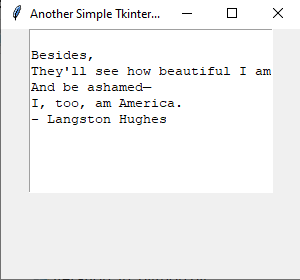

## Tkinter Quiz in Python

1) **T or F**: Only OOP is allowed with Tkinter.
2) **T or F**: Tkinter is a 3rd party library in python.
3) **T or F**: Tkinter is the default GUI library in python.
4) **T or F**: It's not possible to customize Tkinter. 
5) **T or F**: Tkinter and Tk are the same thing. 
6) Which of the following are valid inputs of Tkinter?
	a) import tkinter as tk
	b) import tkinter
	c) from tkinter import all 
	d) from tkinter.charfield import all
	e) a only
	f) a and b
	g) b only
	h) a, b, and c
	i) a, b, c, and d 
7) In order to get the GUI to show, what method must be called?
	a) title
	b) mainloop
	c) scroll
	d) tcl
8) Create a simple GUI with the following specifications. 
	- 300 pixels wide and 300 pixels
	- Contains the title *Simple GUI*
	- Has a background color of *#59A*

	
	
9) Create a simple GUI with the following specification:
	-	300x250 pixels
	-	The title of *Simple Tkinter GUI*
	-	Contains a text widget with height 10 and width 30
	-	Inside the text widget put your favorite quote 
	
